Washington DC Crime Analysis
================

# Washington DC Crime Analysis

\<\<\<\<\<\<\< HEAD \## Adrian Newgard, Benjamin , Ashlynn Prisby  
======= \## Adrian Newgard, Benjamin Herschel, Ashlynn \>\>\>\>\>\>\>
d7f778a3d7f15b741d70021c63caca11c743e90a

As the nation’s capitol, Washington, D.C. is an interesting area to
study socially. In addition to being the capitol, the city is also part
of a large metropolis and contains the usual economic variations
therein. This analysis is focused on incidences of crime in Washington.
It will consider economic, locational, and temporal factors to take a
closer look at the kinds of crime that occur in one of the world’s most
important cities.

## Data

Our primary data is sourced from data.gov, and was provided by the city
of Washington, D.C. It contains incidences of crimes as reported to and
encountered by the Washington police department, covering the year 2024.
A secondary dataset was also used, from the American Communities Survey.
It is discussed in question 1 of the ‘Research Questions’ section.

### Cleaning

Cleaning for the data consisted of removing an empty row and converting
some character values to more convienent classes. During the analysis
itself, some additional cleaning was required, such as using `na.rm` for
some functions.

    ## Rows: 29287 Columns: 25
    ## ── Column specification ────────────────────────────────────────────────────────
    ## Delimiter: ","
    ## chr (13): REPORT_DAT, SHIFT, METHOD, OFFENSE, BLOCK, ANC, NEIGHBORHOOD_CLUST...
    ## dbl (11): X, Y, CCN, XBLOCK, YBLOCK, WARD, DISTRICT, PSA, LATITUDE, LONGITUD...
    ## lgl  (1): OCTO_RECORD_ID
    ## 
    ## ℹ Use `spec()` to retrieve the full column specification for this data.
    ## ℹ Specify the column types or set `show_col_types = FALSE` to quiet this message.

### Variables

    ##  [1] "X"                    "Y"                    "CCN"                 
    ##  [4] "REPORT_DAT"           "SHIFT"                "METHOD"              
    ##  [7] "OFFENSE"              "BLOCK"                "XBLOCK"              
    ## [10] "YBLOCK"               "WARD"                 "ANC"                 
    ## [13] "DISTRICT"             "PSA"                  "NEIGHBORHOOD_CLUSTER"
    ## [16] "BLOCK_GROUP"          "CENSUS_TRACT"         "VOTING_PRECINCT"     
    ## [19] "LATITUDE"             "LONGITUDE"            "BID"                 
    ## [22] "START_DATE"           "END_DATE"             "OBJECTID"

The data contains a number of useful data points, including: -
`OFFENSE`: The type of crime committed - `DISTRICT`, `WARD`, and
`BLOCK`: Locational data of varying specificity. Useful for analysis at
different levels. - `SHIFT`: The time of day that the crime took place.

## Research Questions

### Does the poverty rate of a ward effect the amount of crimes observed there?

To answer this question, the use of another dataset is required. These
data come from a set published by the city of Washington DC and gathered
by the American Community Survey. They contain a variety of statistics
sorted by ward in the city, but for this analysis the only variable in
consideration is `DP03_0128PE`, which gives percentage of a ward’s
population which fell below the poverty line in the previous 12 months
at the time of the data’s collection. The data reveals that, counter to
what we would expect, the areas with the highest crimes
observed–remember, in this dataset, they are from police encounters–are
not actually in the areas with the greatest poverty. However, where the
most police encounters take place makes sense when one considers what is
in wards 2 and 5 particularly: high profile government buildings like
the White House and the Capitol. It seems to be that police are focusing
heavily on these areas to the exclusion of, or perhaps simply ignoring,
more impoverished areas.

    ## Rows: 8 Columns: 157
    ## ── Column specification ────────────────────────────────────────────────────────
    ## Delimiter: ","
    ## chr   (9): NAMELSAD, NAME, GIS_ID, GLOBALID, SLDUST, GEOIDFQ, LSAD, MTFCC, F...
    ## dbl (147): GEOID, DP03_0001E, DP03_0002E, DP03_0003E, DP03_0004E, DP03_0005E...
    ## lgl   (1): SE_ANNO_CAD_DATA
    ## 
    ## ℹ Use `spec()` to retrieve the full column specification for this data.
    ## ℹ Specify the column types or set `show_col_types = FALSE` to quiet this message.

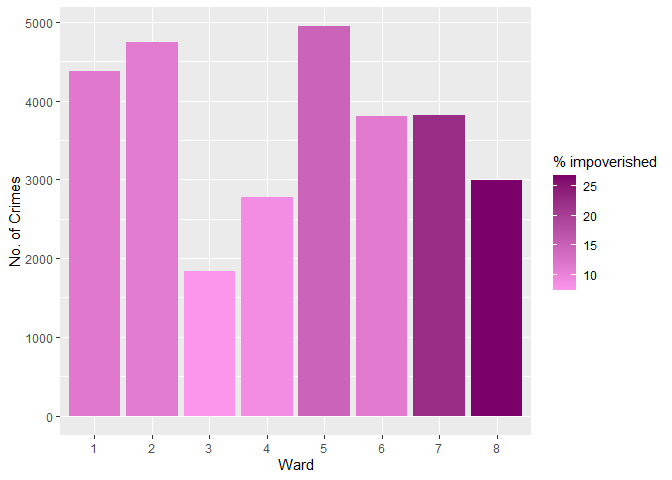<!-- -->

### Does the time of day affect where these crimes are committed?

To get a better understanding of the crimes committed, we wanted to see
if the time of day and where the crimes were located.

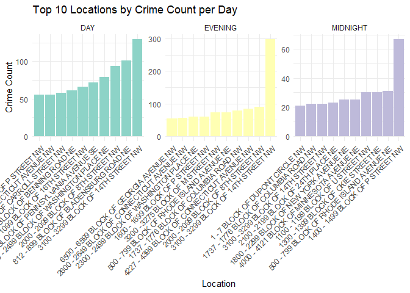<!-- --> By filtering
out the top ten locations in comparison to what time of day they
happened, it gave a better understanding when it was most common for
crimes. It was seen that during the day was the busiest which is
logically as it lines up with when people are at work or tourist are
around. To get a deeper comparison, I filtered out overlapping locations
with time of day and then created a map of the block locations within
the DC area.

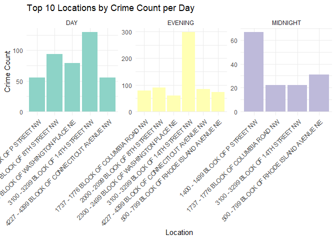<!-- -->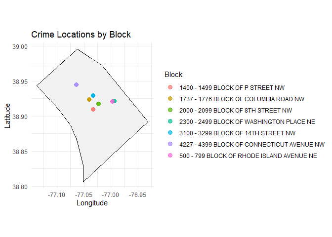<!-- -->

It was seen that all three times of day had an overlap with block
3100-3900 Block of 14th St NW which is located in the center of DC based
on the map. With some research, it was found that location is near the
DC National Mall and a major Subway station which explains why it could
have higher crime rates between the three times of day. Overall, there
was an overlap between 7 locations with the majority being closer into
the city. It was observed with outside research that those locations
were near subway stations which get high traffic during all three times
of day.

### Are there known neighborhoods for a certain crime for that area?

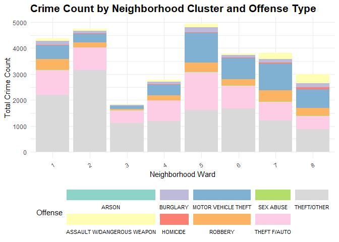<!-- -->

Washington DC is split into 8 wards that I then compared to different
crime types that have been reported. It is seen that Ward 1 and 2 have
the highest crime rate with theft/other being the majority of crimes
committed. When doing further research, it was seen that these two wards
had large tourist areas along with major subway stops that people
frequent. It would explain why the crime rate is much higher since with
a large amount of people visiting these areas crime is expected to be
higher. It also explains why theft from cars is the second highest since
these areas contain lots of street parking within the local
neighborhoods where crime could be heavy.

    ## Warning in RColorBrewer::brewer.pal(n, pal): n too large, allowed maximum for palette Set3 is 12
    ## Returning the palette you asked for with that many colors

    ## Warning: Removed 10042 rows containing missing values or values outside the scale range
    ## (`geom_point()`).

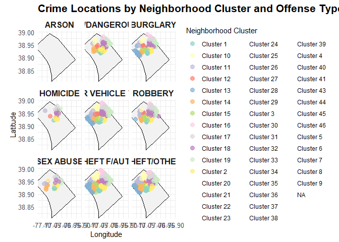<!-- -->

#### Crime Frequency by Shift (Benjamin Herschel)

Of particular interest to me when I had initially looked at the data
present within the set was the prospect of seeing precisely when certain
varieties of crimes are commited, especially so as to identify if there
are interesting patterns within the data as to when certain crimes are
(or, just as importantly, are not) committed.

To quickly preface this section, I will reiterate the shift timings:

- Day : 7am - 3pm
- Evening : 3pm - 11pm
- Midnight : 11pm - 7am

First examined was a general graph (shown below) that simply measured
the overall frequency of crimes committed within each given shift
period.  
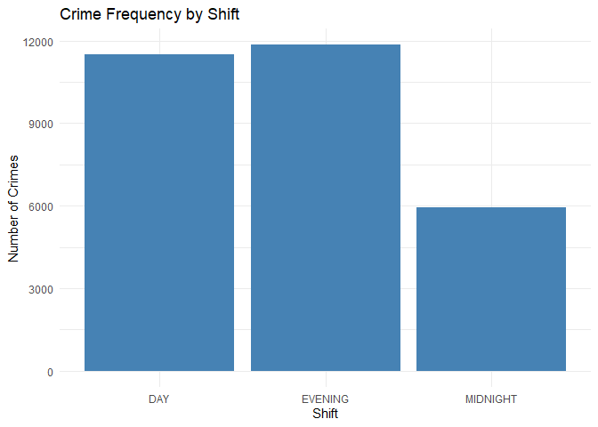<!-- -->

From here I decided to narrow down my search into only the five most
common crime varieties, ditching the less common crimes in favor of
sorting them further into which shifts they tend to occur within, hoping
that this would help me see any potential trends in crime rates relative
to when they occur (such as the disporportionate drop in general theft
rates compared to other crimes during the Midnight shift).

(As an aside here, I do want to briefly touch on the feedback given
during the presentation regarding sorting the data by quantity rather
than by alphabetical order. While I do absolutely see the point raised
here, that it would be easier to read at a glance by sorting them like
that, especially as the order is consistent throughout each shift
period, I decided not to do so. I was concerned that shifting them like
this would make it more difficult to read, rather than less, if the data
presented otherwise, and wanted to ensure that it was consistent in its
order as there is presumably a possibility that, for example, Motor
Vehicle Thefts might increase during Midnight, and therefore placing it
in order of highest to lowest would, I worry, make it more difficult to
read, rather than less, as the order would be inconsistent.)

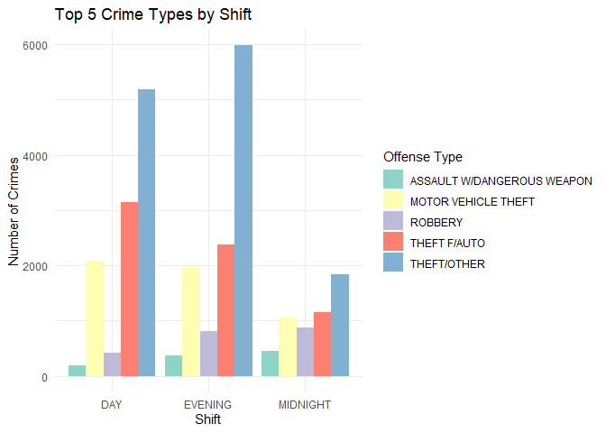<!-- -->

#### Common Methodology Between Crime Varieties (Benjamin Herschel)

Now that I had identified the frequency of various crimes relative to
when they are committed, the obvious follow up seemed, to me at least,
to be to look at how they were committed, identifying common methodology
within specific crimes.  
When I did create the the chart, it became readily apparent that the
crime numbers are too widely distributed to be properly useful in a
visual graphic, so I chose to take the log(10) of the numbers to try to
condense the variation a little bit.

Here is also where the shortcomings in the data become readily apparent,
as the lackluster variety of information on crime methodology means that
while the data is interesting, it does leave much to be desired in terms
of actual conclusions that can be drawn.

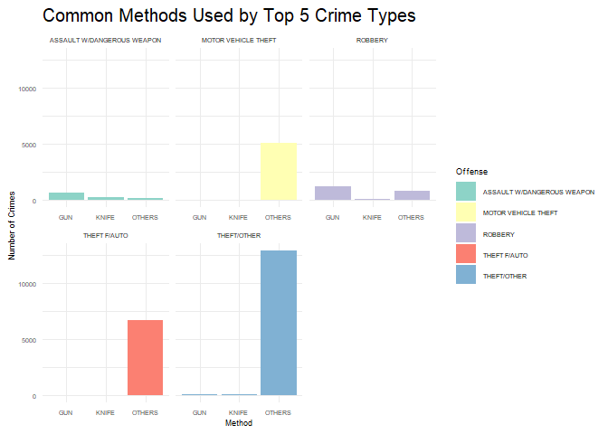<!-- -->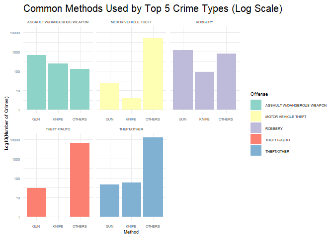<!-- -->

### How many and what crimes occur near the White House and Capitol?

In addition to providing an interesting insight into what goes on around
the seat of the Federal Government, this question can make a comparison
between the two that may reveal how the public interacts with them
differently. Firstly, the White House.
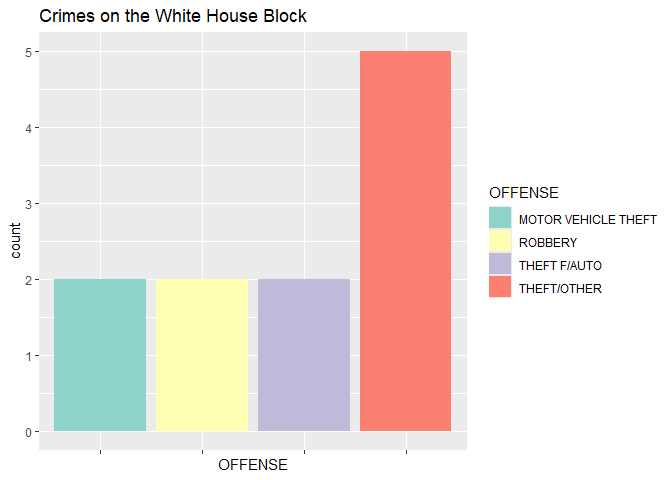<!-- -->

Then, the Capitol. The data has a built-in indicator for whether a crime
took place on Capitol Hill.

    ## [1] 437  24

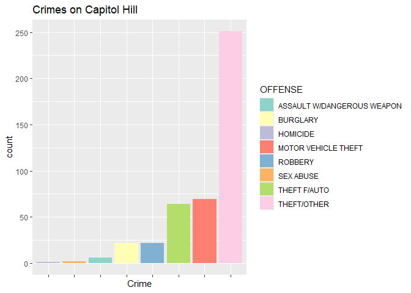<!-- -->

We see that there are many more crimes recorded around Capitol Hill than
the White House. Total, there are 437. There a couple of possibilities
for why this might be. One could be that the heavier security at the
White House acts to keep more criminals away from the building than does
the security at the Capitol. It could also be that there is simply more
opportunity to commit crims in the Capitol Hill area.

## Conclusion

It is clear that DC crime is not tied to a certain factor and is
influenced by many factors. While crime was evident during the day it
was still prominent during all hours of the day which could be due to
not only the area but the people residing in that area. DC is known for
being a tourist, working, and residential areas with many people coming
to visit during different times. It does show within the graphs and data
but there are still neighborhoods who have higher crime rate that may
just not get reported since they are not close to tourist or busy areas.
DC still has the same crime rates as other larger cities may have with
only a few anomalies.

It is evident that the uniqueness of Washington’s purpose as a city
leads to some unexpected occurences in the data. The presence of the
seats of government in the city–the White House, the Capitol, etc.–leads
to increased presence around those areas. The result is an uneven police
distribution across the city in a manner different from other cities.
However, D.C. suffers similar problems to other cities.

Additionally, we can see clear divisions in the crime rates both in
regards to variety, timing, and methodology, throughout the data. This
allows us to better understand how future trends might play out, as well
as giving us an idea of how to best work to prevent undue risk moving
forward.
